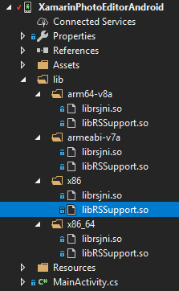
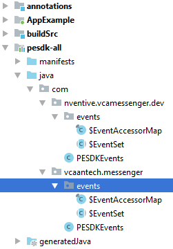

- **Rejecting re-init on previously-failed class : java.lang.NoClassDefFoundError: Failed resolution of: Lkotlin/jvm/internal/Lambda;**   
Add Xamarin.Kotlin.StdLib.Jdk7 int the Startup project and in the library using Kotlin

- ***Failed to register native method android.support.v8.renderscript.RenderScript.rsnScriptReduce***
Created a binding with the renderscript.jar and use it instead of the Nuget Package. And if it still does not work, include the `librsjni.so` and 
`libRSSupport`  libraries tho the Android startup project and set the build action as `AndroidNativeLibrary`



- **Error CS0534: 'CropViewHolder' does not implement inherited abstract member 'DataSourceListAdapter.DataSourceViewHolder.BindData(Object)'**
```csharp
public partial class CropViewHolder
{
    protected override void BindData(Java.Lang.Object item)
    {
        this.BindData(item as LY.Img.Android.Pesdk.UI.Panels.Item.CropAspectItem);
    }
}

<attr path="/api/package[@name='ly.img.android.pesdk.ui.viewholder']/class[@name='CropViewHolder']/method[@name='bindData']/parameter[1]" name="type">java.lang.Object</attr>

```

- **Error CS0535: 'TransformToolPanel' does not implement interface member 'DataSourceListAdapter.IOnItemClickListener.OnItemClick(Object)**
```csharp
public partial class TransformToolPanel
{
    public void OnItemClick(Java.Lang.Object entity)
    {
        OnItemClick(entity as LY.Img.Android.Pesdk.UI.Panels.Item.CropAspectItem); 
    }
}

<attr path="/api/package[@name='ly.img.android.pesdk.ui.panels']/class[@name='TransformToolPanel']/method[@name='onItemClick']/parameter[1]" name="type">java.lang.Object</attr>

```

- **Error CS0535: 'BrushToolPanel' does not implement interface member 'TimeOut.ICallback.OnTimeOut(Object)'**   
Sometimes, a method is not overrided in the class. We have to add it. You have two choices
```csharp
//Create a new class in the Additions folder
public partial class BrushToolPanel
{
    public void OnTimeOut(Java.Lang.Object entity)
    {
    }
}

//OR
//add the new method in the `Metadata.xml`

<add-node path="/api/package[@name='ly.img.android.pesdk.ui.panels']/class[@name='BrushToolPanel']">
        <method name="OnTimeOut" return="void" abstract="false" native="false" synchronized="false" static="false" final="false" deprecated="not deprecated" visibility="public">
            <parameter name="entity" type="java.lang.Object" />
        </method>
</add-node>
```

- **Error CS0111: Type 'UiConfigAspect' already defines a member called 'SetAspectList' with the same parameter types (CS0111)**   
In this case, in the java caode, there are 3 methods `setAspectList`;
```java
public void setAspectList(ArrayList<CropAspectItem>... aspectLists);
public void setAspectList(ArrayList<CropAspectItem> aspectList);
public void setAspectList(CropAspectItem... aspectList);
```

When binding, the first two will generate two methods:
```csharp
public void SetAspectList(IList<CropAspectItem> aspectLists);
public void SetAspectList(IList<CropAspectItem> aspectLists);
```
So we have to remove one of them (in this case the first one):
```xml
<remove-node path="/api/package[@name='ly.img.android.pesdk.ui.model.state']/class[@name='UiConfigAspect']/method[@name='setAspectList' and count(parameter)=1 and parameter[1][@type='java.util.ArrayList&lt;ly.img.android.pesdk.ui.panels.item.CropAspectItem&gt;...']]"/>
```

- ***Error CS0115: 'ColorOptionBrushToolPanel.SetColor(int)': no suitable method found to override || error CS0534: 'ColorOptionBrushToolPanel' does not implement inherited abstract member 'ColorOptionToolPanel.Color.set'***   
In Xamarin binding, when you have two java methods `getColor/setColor(Color color)` for a property, it will create a C# property `Color{get;set;}`   
If you want to force the binding to keep the two methods, set the `propertyName` to an empty string:
```xml 
    <attr path="/api/package[@name='ly.img.android.pesdk.ui.panels']/class[@name='ColorOptionToolPanel']/method[@name='setColor' and count(parameter)=1 and parameter[1][@type='int']]" name="propertyName"></attr>

    <attr path="/api/package[@name='ly.img.android.pesdk.ui.panels']/class[@name='ColorOptionToolPanel']/method[@name='getColor' and count(parameter)=0]" name= "propertyName"></attr>
```


**ANDROID SETUP**   

- Include all the Release DLLs in the Android Project and Add them as reference
- In `Android Properties`, enable `MultiDex`
- Include all the [Styles](styles.xml) in Resources
- Add the [strings](strings.xml) in the Resources.resw
- Add the Nuget package `Xamarin.Kotlin.StdLib.Jdk7`


**CHANGES MADE TO SOURCE SDK**   

- We could not make the master branch to build. There was an issue with the generation of resources (Layout, Styles, Ids...). So we used the `V6 Brranch`. 
```
from Sven Nähler:
Maybe your problem with the master is related to our theme_creator.gradle script. It converts our layout files, copy them to the build folder of each module and changes the path of the resource folder to "build/generated/res/themable".

But when building, I cannot find any folder named build/generated/res/themable. It seems I have an issue with the theme_creator.gradle script and no folder is generated
```

- There is an know issue with Java Generic when binding a Library. 
The DataSourceIdItemList could not be generated with Generic. So the `UiConfigText.java` had to be changed because we had a Cast exception when using the method `convertToFontPreviewItemList`. So we changed the method signature:
```java
//FROM 
private DataSourceIdItemList<FontPreviewItem> convertToFontPreviewItemList(DataSourceIdItemList<FontItem> fontItems, DataSourceIdItemList<FontPreviewItem> fontPreviewItems);

//TO
private DataSourceIdItemList<FontPreviewItem> convertToFontPreviewItemList(ArrayList<FontItem> fontItems, DataSourceIdItemList<FontPreviewItem> fontPreviewItems) 
``` 

- In Xamarin, the resources are generated in a `Resources.designer.cs`. If we have some files/folders in the Xamarin project (Styles, Fonts), the ones from the source SDK won't be availabe. I did not found the cause of that, but the solution I had was to copy the needed strings/styles... inside the Xamarin project

- In the Uno project, we have a font folder in assets named `Fonts`. The method android `Typeface.createFromAsset()` is case sensitive. So when looking for fonts, it was looking at `fonts/namedfont.ttf` whereas in the Xamarin project it is `Fonts/namedfont.ttf`. Our solution was to rename the fonts folders in the java code to `Fonts`. And change the variables `fontAssetsFolder` to `private final static String fontAssetsFolder = "Fonts/";` (assets-font-basic and assets-font-text-design modules)

- In the sample application, at build time, the `PESDKEvents.java` class in Generated. It manage Events for editing. In the binding, we need this class created with our package name. The solution we've used is to create a new Package folder in the module `pesdl-all` with the application package name (ie: com.nventive...) and copy the Events class and the PESDKEvents.java inside it. We create one package folder by package name we need. This way does not allow custom events anymore, but we did not used them.

 


